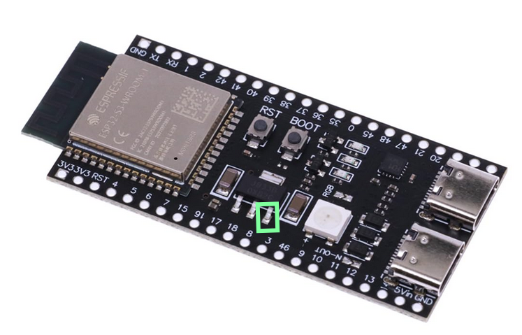

# ESP32-Projects-Thermal-Camera
A ESP32 based Thermal camera setup

This project was inspiered by work done here:

 https://thesolaruniverse.wordpress.com/2022/08/02/a-true-infrared-video-camera-amg8833-sensor-esp32-microcontroller-and-3-2-inch-320240-tft-display/

 
We needed a nice simple, cheap thermal camera with a display to show that a project we have really doesn't generate heat.  We could have gone for the cheap ones from ebay / Amazon / Aliexpress, but where's the fun in that when you can create it yourself.

## The parts required for this build are:

* ESP32-S3 Dev kit (https://www.amazon.co.uk/dp/B0CJY4HNGL)
* Thermal camera (AMG8833) module. (https://www.amazon.co.uk/dp/B0GF1Y4CVM)
* NeoPixel panel (8x8) (https://www.amazon.co.uk/dp/B0DNW1ZPL3)
* 3.5 inch LCD TFT touch display with ili9488 SPI (https://www.amazon.co.uk/dp/B0D6B9M4ZH)

These links to amazon are for example only.  They are all available in other places, so if you're in no rush I'd get them else where and save about 50%.

## Software required:

* Arduinio IDE.
* ESP32 board library
  * TFT_eSPI
  * SparkFun GridEYE AMG88 Library
  * Adafruit NeoPixel

There may be more libraries required, but the IDE will throw an error indicating what you need if it's not installed.  These are things you install then forget all about. :-)

This is a good guide on how to setup the IDE to make it see the ESP32.

https://randomnerdtutorials.com/installing-the-esp32-board-in-arduino-ide-windows-instructions/

Here's another one that tells you how to use the screen:

 https://RandomNerdTutorials.com/esp32-tft/

## Connecting up the parts.

The image below is a picture that shows the pinout for the ESP32-S3 module.

### Screen connection (3.5 inch LCD TFT touch display with ili9488):

The screen needs 14 connections between the ESP32 and the screen to work.  Some of these will be for the touch screen, so not actually used in this project (yet), but it's easier to connect them now than to add them later, once it's all in the box.

Going from Left to right from the back of the screen connect like below:

| Screen header | ESP32-S3 Pin |
| ------------- | ------------- |
| VCC  | 3V3 pin  |
| GND  | GND pin  |
| CS  | 4  |
| RESET  | 5  |
| D/C  | 6  |
| SDI  | 7  |
| SCK  | 15  |
| LED  | 16  |
| SDO (MISO)  | 17  |
| T_CLK  | 18  |
| T_CS  | 8  |
| T_DN  | 3  |
| T_OUT  | 46  |
| T_IRQ  | 9  |

This order was picked to make life easier when conneting the parts together, not for anything eles.  It can all be changed in the "User_Setup.h" file if needed.

### Thermal Sensor connection (AMG8833):

As this is just a I2C connection, it's nice and simple, and only has 4 wires to connect.

| Sensor Pin | ESP32-S3 Pin |
| ------------- | ------------- |
| VIN  | 3V3 pin  |
| GND  | GND pin  |
| SCL  | 1  |
| SDA  | 2  |

### NeoPixel Panel:

This needed a bit of inventive work as these panels work best at 5V.  They do run at 3.3V but it's not recomended.

| Sensor Pin | ESP32-S3 Pin |
| ------------- | ------------- |
| V+  | 5V (see pic below)  |
| GND  | GND pin  |
| IN  | 21  |

Connect the 5V pin to the pin of the regulator boxed in green.

Once wired up, you should be able to build and upload this project without any problems.

I'm sure I've missed stuff, or done something wrong, but this will do for now.
